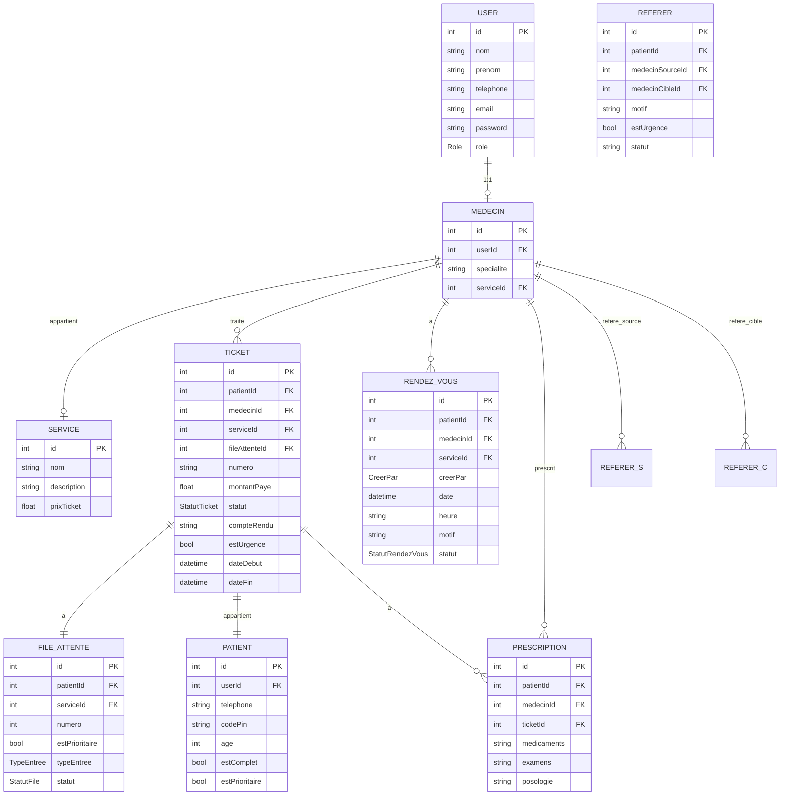

# Diagramme de Classe - Module Médecin (Pulsway)

## Schéma Prisma Mis à Jour



## Architecture du Module Médecin

```
src/modules/medecin/
├── MedecinController.ts    # Endpoints HTTP
├── MedecinService.ts       # Logique métier
├── MedecinRepository.ts   # Accès base de données
├── MedecinRoute.ts        # Définition des routes
└── dto/
    ├── index.ts
    ├── create-rendezvous.dto.ts
    ├── prescription.dto.ts
    ├── referer.dto.ts
    └── consultation.dto.ts
```

## Routes API Médecin

| Méthode | Endpoint | Description |
|---------|----------|-------------|
| GET | `/api/medecin/profile` | Obtenir le profil du médecin |
| GET | `/api/medecin/file-attente` | Obtenir la file d'attente (triée par priorité) |
| GET | `/api/medecin/rendez-vous` | Obtenir les rendez-vous |
| POST | `/api/medecin/rendez-vous` | Créer un rendez-vous |
| GET | `/api/medecin/tickets` | Obtenir les tickets |
| GET | `/api/medecin/tickets/:id` | Obtenir un ticket par ID |
| POST | `/api/medecin/consultation/:id/debut` | Démarrer une consultation |
| POST | `/api/medecin/consultation/:id/fin` | Terminer une consultation |
| POST | `/api/medecin/tickets/:id/urgence` | Déclarer une urgence |
| POST | `/api/medecin/prescription` | Créer une prescription |
| GET | `/api/medecin/prescriptions/:patientId` | Obtenir les prescriptions d'un patient |
| POST | `/api/medecin/referer` | Référer un patient |
| GET | `/api/medecin/referers` | Obtenir les patients référés |

## Règles Métier Implémentées

### 1. File d'Attente
- **Priorité** : Patients ≥ 60 ans (`estPrioritaire = true`) en premier
- **Ordre** : Puis par heure d'arrivée (`heurePrise`)

### 2. Gestion de Consultation
- **Démarrage** : `EN_ATTENTE` → `EN_COURS` + enregistrement `dateDebut`
- **Fin** : `EN_COURS` → `TERMINE` + enregistrement `dateFin` + `compteRendu`

### 3. Urgences
- Peut être déclaré sur un ticket en attente ou en cours
- Marque le ticket avec `estUrgence = true`

### 4. Référé
- Un médecin peut référer un patient vers un autre médecin
- Indiquer si cas d'urgence (`estUrgence`)
- Le motif est obligatoire
